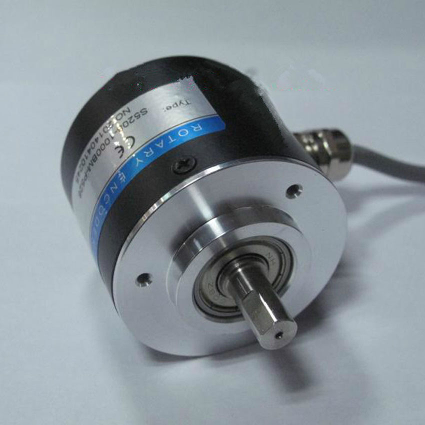
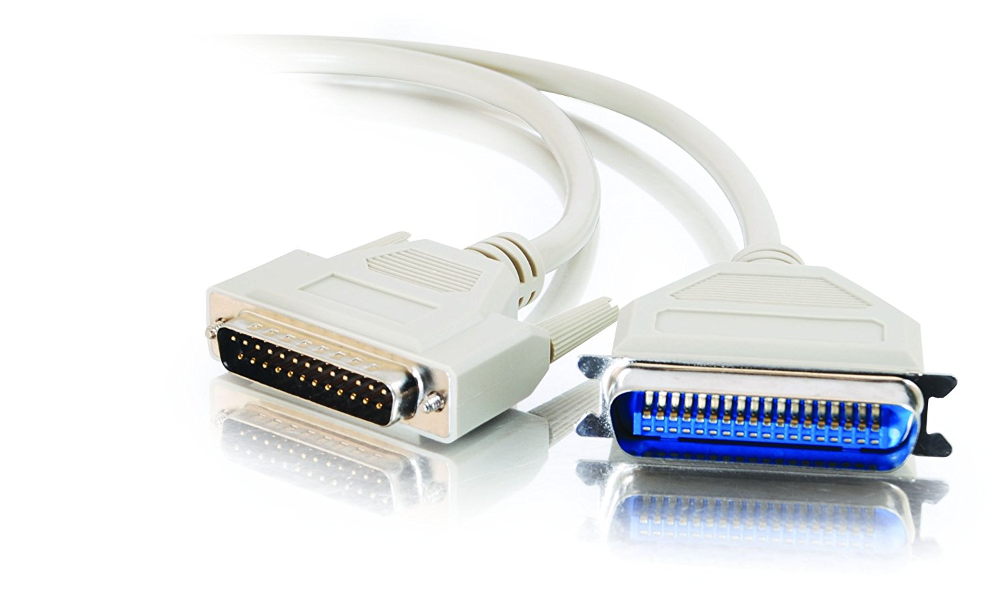
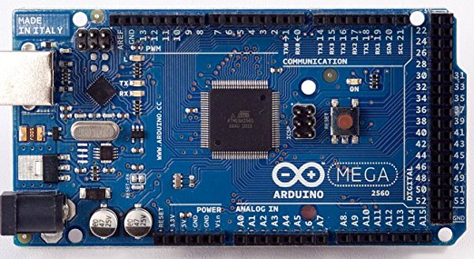
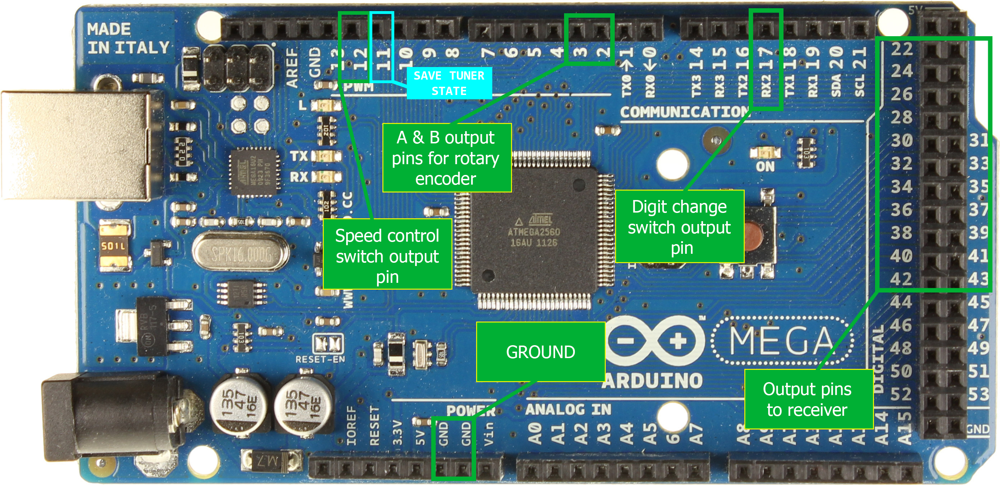
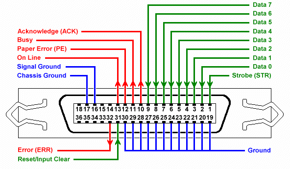

## ARDUINO VFO TUNER FOR A HARRIS RF-550

Early development of synthesizers for receivers/transmitters during the 1970s-1980s gave crystal stability to radio gear. But instead of several crystals to determine an operating frequency, the new synthesizer technology allowed 1000s or more possible channels. Naturally the military were the first users and the fact that the synthesizer had to be programmed did not deter orders. These synthesizers were generally controlled by decade thumbwheel switches. These were mechanical switches that selected a digit and then provided a 4 line BCD output to digitally encode the selected number. Some variations showed up of this tuning scheme, such as up down switches instead of decade switches, or pusbuttons that incremented one digit at a time. Not too handy for amateur radio gear or a home shortwave receiver, but just the ticket to select a known accurate channel while fighting in the field or monitoring an enemy station.
The Harris RF-550 shown was developed around this time. It was designed to be a top performing receiver, used in intercept work, military communciations stations, and three letter agency listening posts. Because of the incredible costs, no one else could afford one.
Time rolls on and they now are obsolete from a military standpoint but certainly not from a hobbyists point of view. From the original, inflated adjusted price of 50K they now can be occasionally found for as little as 1 or 2 cents on the dollar. And you still get a beautiful, rugged and super performing receiver. The down side is they are a pain to tune. Not comfortable for bandcruising, best for just monitoring a net or your favorite frequencies.

### History of this receiver

I got this radio in trade. It was honestly described as having a problem with the above mentioned tuner, some digits would tune others not. I am no expert in digital electronics, having used mostly vacuum tube stuff. But never shy of a challenge, I figured I couldn't make it worse, so why not?
My first lesson with the Harris was the tuner on it was not the standard 0-9 thumbwheels but 6 up/down switches that controlled frequency selection. One switch for each digit in frequency selection.

**XX XXX X**

From left to right:
- 10 MHz
- 1 Mhz
- 100 kHz
- 10 kHz
- 1 kHz
- 100 Hz

Fortunately this receiver came with a full service manual so I thought I'd have a fighting chance at a repair. WRONG! The manual was for the original version, the up down switches were an option and not covered. Then ensued a search for the manual on this tuner. I finally came to the conclusion it does not exist (not even at Harris). The tune up/down board has 40 IC's and is way beyond my ability to troubleshoot blind.
I did eventually manage to find two lines on the I/O connector going to the board that did not change state as they shoud do. Manually toggling them started to produce the missing frequency segments. Installing two small switches at the side of the receiver restored its full tuning range, 0-30 MHZ.

I was very happy with this arrangement but started to wonder if it would be possible to remote tune the radio in some fashion with a VFO. Looking at the schematics, the receiver was designed for remote control, either just frequency or full remote of all functions. Hmmm, the I/O work has already been done by Harris. Checking further, I found all the communications lines used TTL level, (+5, 0). Still current, 40 years later.

BCD requires 22 lines for this operation, four for each tuning digit except 10 Mhz which only requires two. I received several suggetions but when I read about the Arduino Mega, I knew I had a winner. First, it talks in TTL so there would be no level shifting, isolators, or other electronics and second the Arduino has over 50 I/O lines so its a piece of cake to control 22 lines.

So, a project began to take shape. I determined I would need the following in order to achieve success.
1. Enclosure, and suitable hardware
2. A quality rotary encoder, I opted for 100 pulses per revolution.
3. A Centronics printer cable. That is the connector used on the back of the radio, Centronics 36 pin. Still available.
4. An Arduino Mega
5. Software for the Mega

## Enclosure

Pretty much open on this one. I opted for something I had lying around. It was about the right size and metal, I did not want to use plastic in it if possible. I always suggest starting with something simple, you can always improve the product afterwards. 6 X 5 x 2 inches will hold everything with extra room available. Obviously, there is some drilling and cutting here, and if you have to start with a plastic case don't feel detered.

## Encoder

Find a nice smooth encoder with 100-200 pulse per revolution. This gives a nice analog feel to the tuner. If its too touchy you can turn down the p/r in software to get anything you like. The encoders generally have a wide operating voltage 5-20 volts and are readilly available on ebay for $20.00 or less. I bought an Omron unit but probably anything of quality will do. The encoder needs four lines, 12 volt, GRD, A and B. No reason you could not try one of those click tune encoders, that might be fun too.

    

## Cable

I had a bit of trouble with this one. I ordered a Centronics cable on ebay and I 'assumed' each of the 36 pins would be wired to the corresponding pin on the opposite end. WRONG. The actual Centronics printer only used abut 25 pins and this required me rewiring the cable. I might add at this point one of the greatest difficulties I had was in doing the fine wiring and cabling between the Arduino and the radio. Less than perfect eyesight and hand shake makes it a challenge! In any event you are going to need a cable with 22 wires plus ground going from your radio to the Arduino. The Arduino uses header pins, readilly available. You can cable it up anyway you want, as long as there are no opens and no shorts. I think I paid about 20 buck for the cable.

    

## Arduino MEGA

Available everywhere either original or cloned. I bought a clone, it was less than $30.00

    

## Software

The heart of this project is the software that runs everything. Doing this with regular IC's would mean a circuit board and 40 or 50 chips. Now you have the choice of writing the sketch yourself for your set or you can use the sketch I wrote. 
There are unlimited options with the Arduino to improve, expand and employ it to many other radios besides just the RF-550. There were many military based sets from the early 80's that employed pushbutton, decade switches, or other programming methods to select frequency.

To install the software, firstly download the whole repository and install [Arduino IDE](https://www.arduino.cc/en/software).
Connect Arduino to your PC.
Lastly, open sketch **VFOTuner.ino** using the IDE, select an appropriate COM port and click **Upload** button.

## Construction

If you are with me so far and decide to use the pin assignment I did you will wire the radio to the Arduino in the following manner:

| RADIO PIN NO  | ARDUINO PIN NO  | BCD  |
| :------------: | :------------: | :------------: |
| 1 | 22  |10 MHz-1  |
| 2 | 23  |2   |
| 3 | 24  | 1 MHz-1  |
| 4  | 25  | 2  |
| 5 | 26  | 4  |
| 6 | 27  |  8 |
| 7 | 28  | 10 kHz-1  |
| 8 | 29  | 2  |
| 9 | 30  | 4  |
| 10 | 31  | 8  |
| 11 | 32  | 1 kHz-1  |
| 12 | 33  | 2  |
| 13 | 34  |  4 |
| 14 | 35  | 8  |
| 15 | 36  | 1 kHz-1  |
| 16 | 37  | 2  |
| 17 | 38  | 4  |
| 18 | 39  | 8  |
| 19 | 40  | 100 Hz-1  |
| 20 | 41  | 2  |
| 21 | 42  | 4  |
| 22 | 43  | 8  |
| GND | GND  |   |

**ROTARY ENCODER**
- Connect Output **A** to  **PIN 3** on Arduino.
- Connect Output **B** to **PIN 2** on Arduino.
- You do not need any connection with the **Index** pin on your encoder.

**DIGIT CHANGE**
- Arduino **PIN 17** - should be connected to a **push-button** which changes the frequency step size when the nob on the encoder is rotated.

**SPEED CONTROL**
- Arduino **PIN 12** - should be connected to a **toggle button** that will enable/disable speed mode for the tuner. Essentially, with the speed mode enabled the frequency will change twice as fast when the encoder nob is rotated.

**SAVE TUNER STATE**
- Arduino **PIN 11** - should be connected to a **push-button** that saves the current tuner state to the *EEPROM*. This state will be loaded on Arduino restart.

    

**Pin outs for Centronics cable:**

    

## CONCLUSION

That is about it. Once you have the radio cabled to the Arduino you should be good to go. The RF-550 has two remote positions one for frequency only (how nice is that!). Considering it changes the radio into a whole new set, I would suggest anyone with one of these radios undertake. Good luck with it!

You can check it performing here (YouTube):

    

